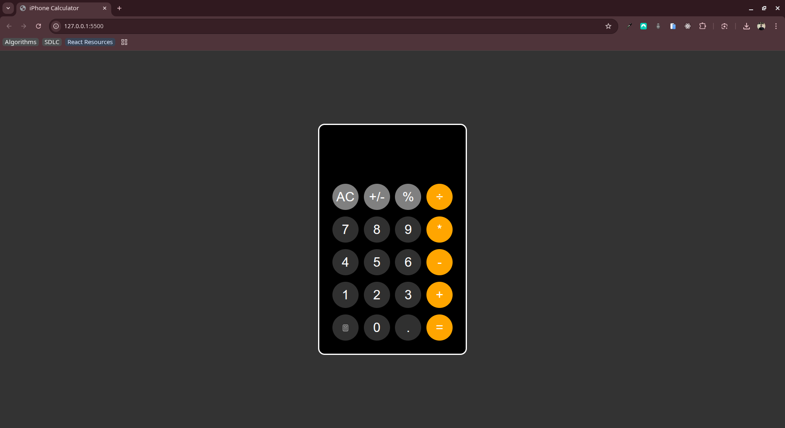

# JS BASIC CALCULATOR

## App

## Project Overview

Replicate the design and functionality of the basic iphone calculator.

 Taking into consideration
1. The design
2. The functionality 

Design can be gotten here 

## Clone Project

- To get a local copy up and running follow these simple example steps.
- Clone this repository with `git@github.com:Chu29/js-calculator.git` using your terminal or command line.
- Change to the project directory by entering: `cd js-calculator` in the terminal.

## Command line steps

- $ git clone `git@github.com:Chu29/js-calculator.git`
- $ `cd js-calculator`
- $ `git checkout feature/calculator`

## Live Site

[JS BASIC CALCULATOR](https://chu29.github.io/js-calculator/)

## Author

**Chu Abuemkeze M.K**

- GitHub: [@Chu29](https://github.com/Chu29)
- Twitter: [@chu_codes](https://x.com/chu_codes)
- LinkedIn: [Chu Abuemkeze M.K](https://www.linkedin.com/in/chu-abuemkeze/)
